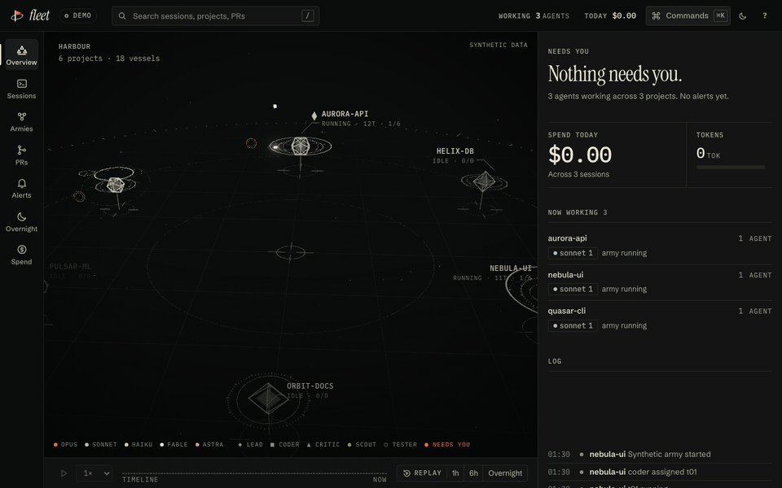
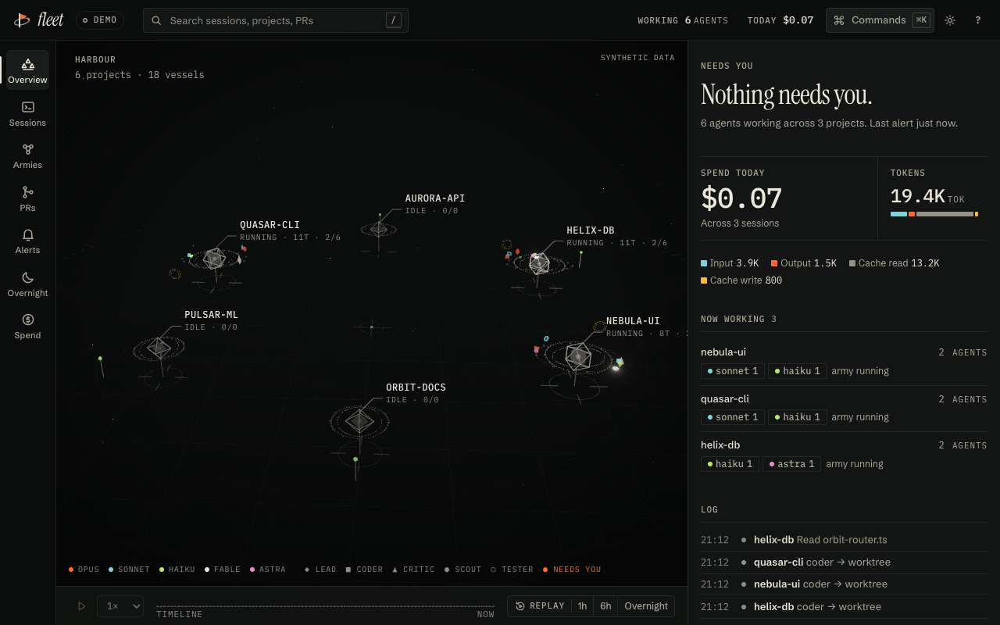
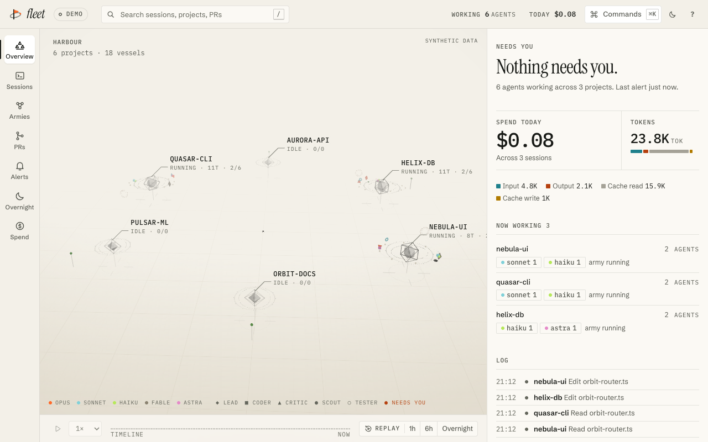
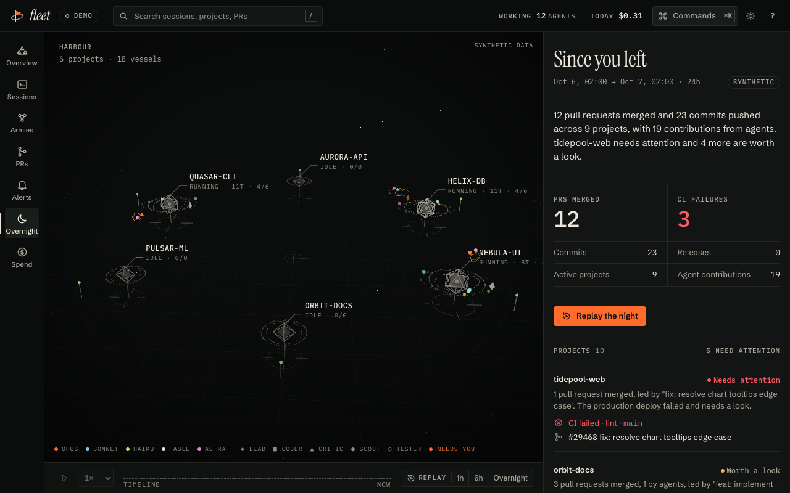
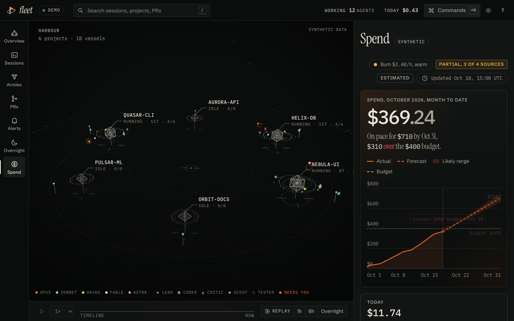
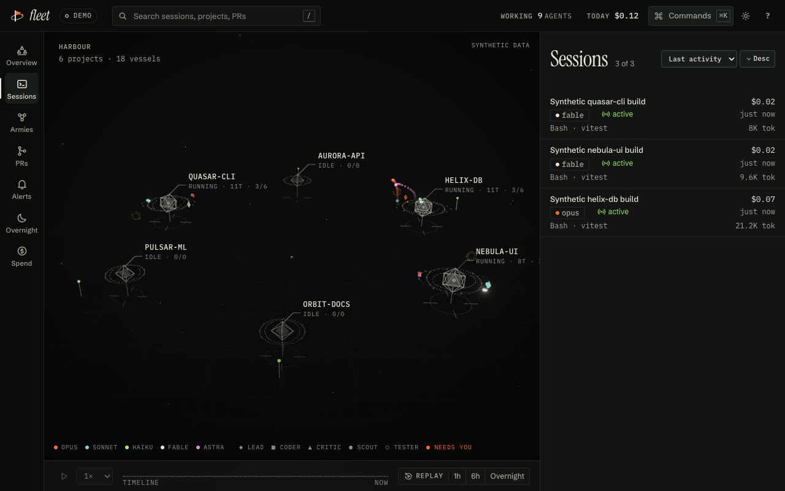
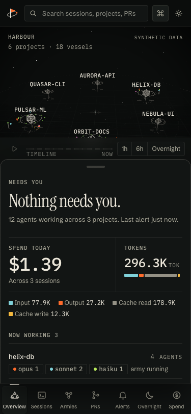

# Fleet

Mission control for Claude Code agents. See every session, army, PR and dollar in one live view, and get pinged only when something needs you.



All images here come from Fleet's built-in synthetic demo. No real sessions are shown.

|                                                                  |                                                            |
| ---------------------------------------------------------------- | ---------------------------------------------------------- |
|          |  |
|  |  |
|     |       |

## What it is

Fleet is a local daemon plus a web app. The daemon reads the transcripts Claude Code already writes under `~/.claude/projects`, works out which sessions and agent armies are running, and serves a live view of them.

- A 3D harbour of your projects and agents, with a dashboard beside it: sessions, armies, PRs, alerts.
- A "Needs you" panel that stays quiet until an army is blocked, a session is waiting, CI fails or a deploy fails.
- Replay of the last hour, six hours or the night.
- Overnight, a morning digest of what shipped across your repos and deploys.
- Spend, a month-to-date total, forecast and budget across your coding agents.
- A phone-friendly layout, installable as a PWA.

Fleet is a v1.0.0 release. It is macOS-first (the launchd agent and menu-bar app are macOS only); the collector and web app are plain Node and should run elsewhere, but that is not tested.

## Install

You need Node 20 or newer.

```sh
curl -fsSL https://raw.githubusercontent.com/ysta32/fleet/main/scripts/install.sh | FLEET_FROM_GIT=1 bash
```

This clones the repo into `~/.fleet/src`, builds it, installs the `fleet` command, writes the launchd agent `dev.fleet.collector` so the collector starts at login, and prints the local URL (`http://127.0.0.1:4747/` by default). Rerunning is safe. It never touches `~/.claude/settings.json`.

From a checkout you already have, run `FLEET_FROM=/path/to/checkout bash scripts/install.sh`. Without `FLEET_FROM_GIT`, the script installs the `fleet-collector` npm package instead. Other variables: `FLEET_PREFIX=<dir>` for a custom npm prefix, and `FLEET_NO_LAUNCHD=1` to write the plist without loading it.

If something looks wrong, run `fleet doctor`. It checks Node, the port, `~/.claude/projects`, `gh auth`, config permissions, launchd and web assets, and exits 0 (ok), 1 (warnings) or 2 (failures).

## Run

```sh
fleet            # help and the list of commands
fleet start      # run the collector in the foreground
fleet demo       # run with synthetic demo data, nothing read from your machine
fleet open       # open the dashboard
fleet status     # daemon health and counts
fleet token      # print the access token and LAN URL
fleet install    # install and load the launchd agent (--dry-run prints the plist only)
fleet uninstall  # unload and remove the launchd agent
```

`fleet demo` is the quickest way to look around. It uses the same synthetic fleet as the screenshots above.

## Phone access

By default the collector listens on `127.0.0.1` only, and loopback needs no token. To open Fleet on your phone:

1. Set `"lan": true` in `~/.config/fleet/config.json` and restart the collector. It then binds `0.0.0.0`.
2. Run `fleet token` to get the access token and the LAN URL, and open that URL on your phone. Remote requests must carry the token.
3. Prefer [Tailscale](https://tailscale.com/) over a bare LAN: put your phone and Mac on one tailnet and use the Mac's tailnet address. If you reach it by a hostname such as `mymac.tailnet.ts.net`, add it to `allowedHosts` in the config.

Remote clients get a redacted view (see Privacy). Set `"shareContent": true` only if you want them to see transcript-derived text too.

## Notifications

Fleet alerts on blocked armies, finished armies, waiting sessions, failed CI and failed deploys. Choose the kinds in `notify.kinds`.

- macOS notifications, on by default (`notify.macos`).
- [ntfy](https://ntfy.sh/): set `notify.ntfyUrl` to your topic URL. Use a hard-to-guess topic name, since ntfy topics are public by default.
- Web Push to the installed PWA on your phone. The collector generates its own VAPID keys on first use and stores them locally. Browsers require a secure context for push, so serve Fleet over HTTPS (Tailscale can do this) for it to work. Web Push is off in demo mode.

Push and ntfy payloads are redacted the same way as remote views.

## Privacy

- The collector is read-only. It reads transcripts and never writes to `~/.claude` or changes your Claude Code settings.
- It binds loopback by default. Nothing is reachable from another machine until you set `lan: true`.
- Non-loopback clients need the token, and the Host header is checked to defend against DNS rebinding.
- Remote clients get a redacted snapshot: project and agent identifiers become opaque, and transcript-derived text such as STATUS lines is withheld unless `shareContent` is true.
- No transcript content leaves your machine unless you opt in: by turning on `shareContent`, by pointing `notify.ntfyUrl` at a server, or by subscribing a device to Web Push. GitHub status uses your own `gh` login and is read-only; set `github: false` to turn it off.
- Fleet Spend and the Overnight digest run locally. The digest's optional Notion, email and push delivery are off until you configure them.
- This repository ships only synthetic fixtures. CI guards against committing real transcripts.

## Packages

| Package                                                        | What it is                                                                    |
| -------------------------------------------------------------- | ----------------------------------------------------------------------------- |
| [`packages/collector`](packages/collector) (`fleet-collector`) | Read-only daemon and the `fleet` CLI: transcripts, GitHub status, alerts, API |
| [`packages/web`](packages/web) (`@fleet/web`)                  | The web app: 3D harbour, dashboard, replay, PWA                               |
| [`packages/ui`](packages/ui) (`@fleet/ui`)                     | Halyard, the design system: tokens, fonts, icons, motion                      |
| [`packages/shared`](packages/shared) (`@fleet/shared`)         | Protocol types, cost estimator, synthetic demo fleet                          |
| [`packages/digest`](packages/digest) (`@fleet/digest`)         | Overnight, the morning digest of what shipped across repos and deploys        |
| [`packages/spend`](packages/spend) (`fleet-spend`)             | Local spend tracker: month to date, forecast, budget, by repo and model       |

The marketing site and docs live in [`apps/site`](apps/site) at <https://fleet-jet-seven.vercel.app>.

## Menu-bar app

An optional macOS status app shows the collector state and the needs-you count in the menu bar. It needs the Swift compiler from the Command Line Tools and has no other dependencies. See [`menubar/README.md`](menubar/README.md).

```sh
bash menubar/build.sh
open menubar/build/FleetBar.app
```

## Development

npm workspaces, Node 20 or newer, TypeScript, vitest and prettier.

```sh
git clone https://github.com/ysta32/fleet && cd fleet
npm ci
npm run build
npm test
npm run format:check
```

`npm run shots` and `scripts/make-gif.mjs` capture screenshots and the hero GIF with Playwright, from demo mode only. See [CONTRIBUTING.md](CONTRIBUTING.md) for the repo layout and the privacy rule: never commit real transcripts, `.env` files, or screenshots of real sessions. The design system is described in [DESIGN.md](DESIGN.md), and release notes are in [CHANGELOG.md](CHANGELOG.md).

## License

[MIT](LICENSE)
