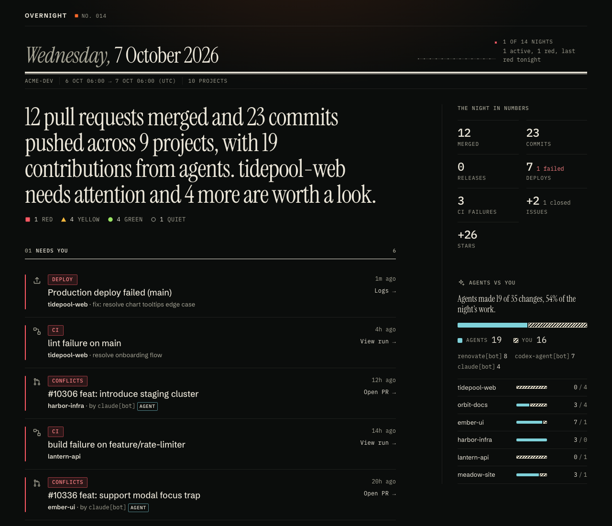
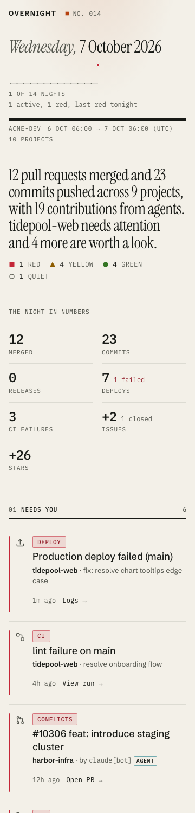
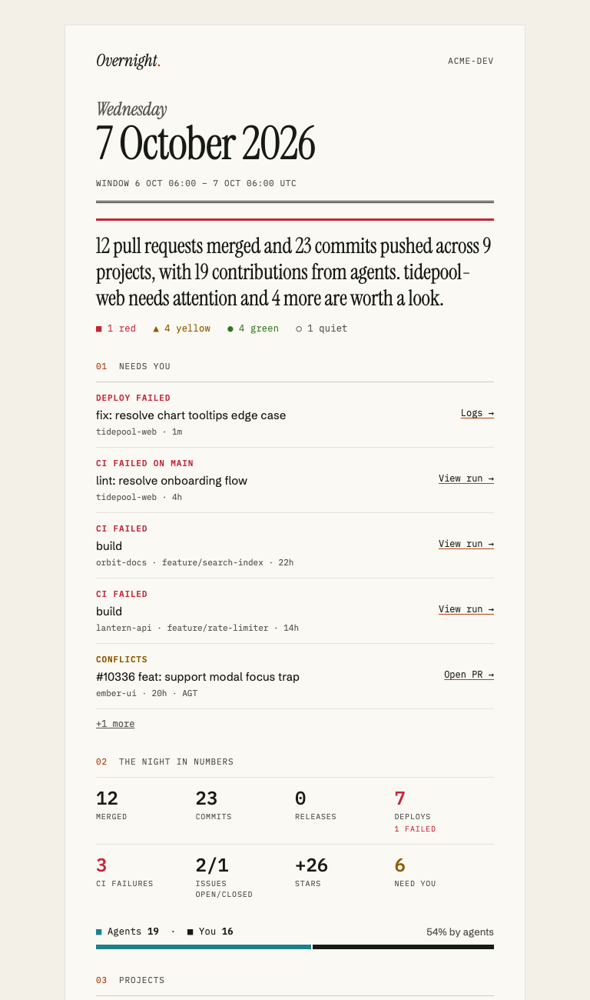
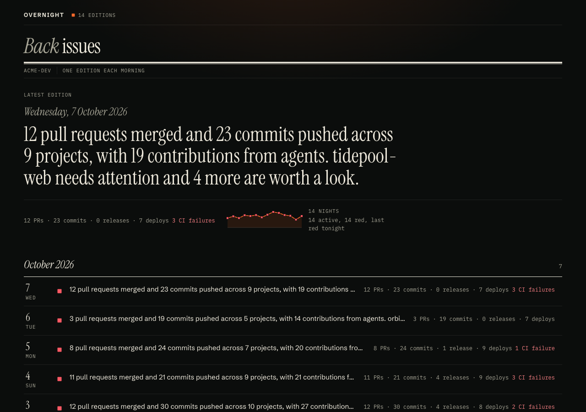

# Overnight — Fleet's morning digest

Overnight scans your GitHub repos and Vercel deployments and writes one calm morning digest of everything that
shipped while you slept, including what your AI agents did.



| Phone, light                                                                 | Email                                                                  | Archive                                                                   |
| ---------------------------------------------------------------------------- | ---------------------------------------------------------------------- | ------------------------------------------------------------------------- |
|  |  |  |

All screenshots use the synthetic `acme-dev` demo data (`src/demo/scenarios.ts`); no real repositories appear.
Visual regression: `npm run build && npm run visual` compares 168 shots (7 scenarios × page, archive and email ×
light and dark × 360/768/1280/1920) against `test/visual/baseline/`. See [DESIGN.md](DESIGN.md).

## What it shows

- Merged PRs, default-branch commits, releases, issues opened/closed
- CI failures and Vercel deployments (production and preview)
- Open PRs that need attention (review requested, CI failing, stale, conflicts, approved but unmerged)
- Stars and forks deltas, optional traffic
- Contributions by bots and agents
- A per-project health light (green, yellow, red, quiet) and a plain-language headline

Output is JSON (the contract in [SCHEMA.md](SCHEMA.md)), a static HTML archive, and optional Notion, email and push
delivery.

## Quick start

Overnight lives in the Fleet npm-workspaces monorepo.

```sh
git clone https://github.com/ysta32/fleet && cd fleet
npm ci
npm run build -w @fleet/digest
export OVERNIGHT_GITHUB_TOKEN=...   # fine-grained, read-only; see Secrets
node packages/digest/dist/cli.js --since 24h
# or, inside the repo after build (workspaces link the bin):
npx overnight --since 24h
```

Try it without any tokens: `node packages/digest/dist/cli.js demo --out public --days 14`.

## CLI reference

`overnight [run] [flags]`

| Flag           | Meaning                                                                                                |
| -------------- | ------------------------------------------------------------------------------------------------------ |
| `--since`      | Window start: duration (`90m`, `24h`, `7d`, `2w`) or ISO date. Default: last run, else `defaultSince`. |
| `--until`      | Window end (ISO). Default: now.                                                                        |
| `--config`     | Path to config file (default `overnight.config.json` in cwd).                                          |
| `--out`        | Output directory (default `~/.overnight/archive`).                                                     |
| `--no-llm`     | Skip the LLM; use the deterministic summarizer.                                                        |
| `--no-deliver` | Write the archive but do not send Notion/email/ntfy.                                                   |
| `--json`       | Print the Digest JSON to stdout.                                                                       |
| `--dry-run`    | Collect and print without writing files, delivering or saving state.                                   |

`overnight demo --out public --days 14` writes a synthetic archive. `overnight init` writes a starter
`overnight.config.json`.

## Configuration

`overnight.config.json` (no secrets in this file):

```json
{
  "owner": "ysta32",
  "include": ["fleet*", "overnight"],
  "exclude": ["scratch-*"],
  "agents": ["my-agent-user"],
  "timezone": "America/Los_Angeles",
  "vercelProjects": { "fleet-web": "fleet" },
  "deliver": {
    "notion": { "enabled": true, "databaseId": "..." },
    "email": { "enabled": false, "to": "me@example.com", "from": "Overnight <digest@example.com>" },
    "ntfy": { "enabled": true, "topic": "my-overnight", "server": "https://ntfy.sh" }
  }
}
```

Environment variables (override the file):

| Variable                       | Purpose                                        |
| ------------------------------ | ---------------------------------------------- |
| `OVERNIGHT_OWNER`              | GitHub user or org to scan                     |
| `OVERNIGHT_INCLUDE`            | Repo name patterns to include (`*` wildcard)   |
| `OVERNIGHT_EXCLUDE`            | Repo name patterns to exclude                  |
| `OVERNIGHT_OUT`                | Output directory                               |
| `OVERNIGHT_STATE`              | State directory (default `~/.overnight/state`) |
| `OVERNIGHT_SITE_URL`           | Public URL of the deployed archive, for links  |
| `OVERNIGHT_NTFY_TOPIC`         | ntfy topic                                     |
| `OVERNIGHT_NOTION_DATABASE_ID` | Notion database to add a row to                |
| `OVERNIGHT_NOTION_PAGE_ID`     | Notion page to append to                       |
| `OVERNIGHT_EMAIL_TO`           | Email recipient                                |
| `OVERNIGHT_EMAIL_FROM`         | Email sender                                   |
| `OVERNIGHT_TRAFFIC`            | Enable traffic collection                      |

## Secrets

Secrets come only from environment variables (or GitHub Actions secrets), never from config files.

| Variable                 | Used for                                                                                                                 |
| ------------------------ | ------------------------------------------------------------------------------------------------------------------------ |
| `OVERNIGHT_GITHUB_TOKEN` | Fine-grained PAT, read-only: Contents, Metadata, Pull requests, Issues, Actions read (+ Administration read for traffic) |
| `VERCEL_TOKEN`           | Vercel deployments (optional)                                                                                            |
| `ANTHROPIC_API_KEY`      | LLM summaries (optional)                                                                                                 |
| `NOTION_TOKEN`           | Notion delivery                                                                                                          |
| `RESEND_API_KEY`         | Email delivery                                                                                                           |
| `NTFY_TOKEN`             | Protected ntfy topics (optional)                                                                                         |

## Scheduling

A ready-made GitHub Actions workflow lives in [`examples/`](examples/README.md). It runs daily at 06:00 PT and
commits the archive to an `overnight-archive` branch. **Run it from a private repository**: digests summarise
private activity, so the workflow refuses to run in a public repo and never writes to ysta32/fleet.

Alternative: Vercel Cron (or any cron host) can run the same CLI command, as long as it has Node 20+, the built
package and the environment variables.

## LLM

Default model is `claude-sonnet-5-5`, with a single request per digest. With no `ANTHROPIC_API_KEY`, or on a
refusal or error, Overnight falls back to a deterministic summarizer, so a digest is always produced. Use
`--no-llm` to force the fallback. The digest records which one ran in `summarizer`.

## Delivery

- Notion: adds a row to a database (`OVERNIGHT_NOTION_DATABASE_ID`) or appends to a page (`OVERNIGHT_NOTION_PAGE_ID`)
- Email: via the Resend HTTP API
- Push: ntfy topic notification

Failures in one channel never stop the others or the archive. Use `--no-deliver` to skip all delivery.

## Fleet integration

Fleet's dashboard reads `<out>/latest.json` (daemon: `GET /api/digest/latest`) and can embed the HTML fragment. See
[SCHEMA.md](SCHEMA.md) for the full contract.
