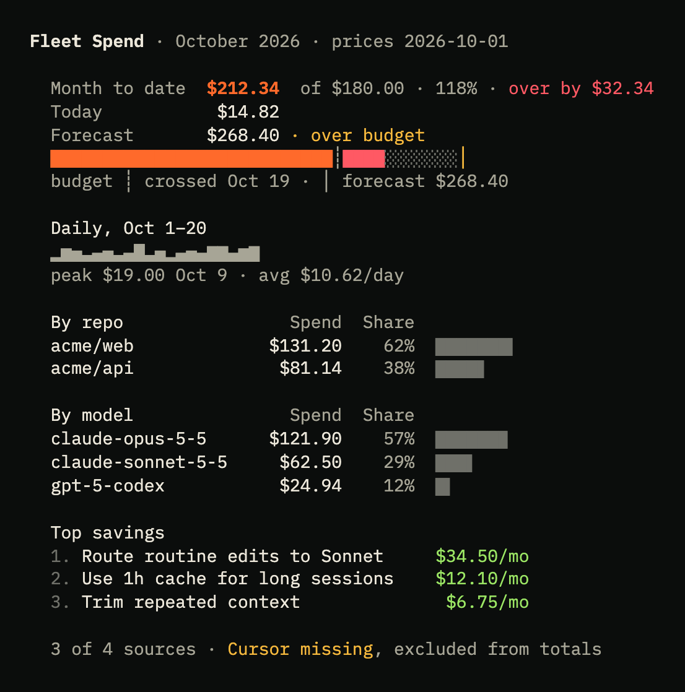
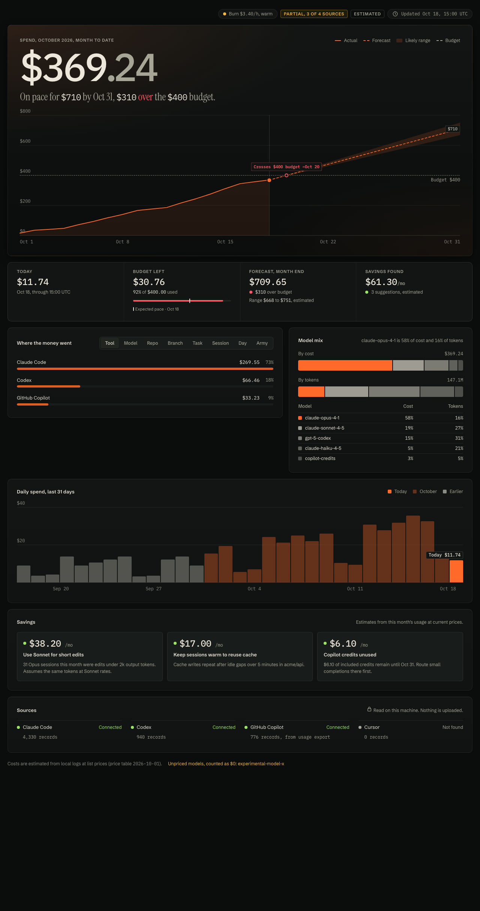
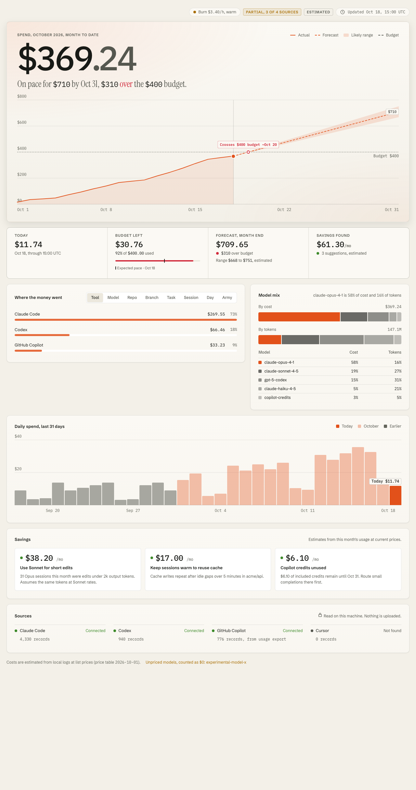

# fleet-spend

Local spend tracker for AI coding agents. It reads the usage logs your tools already write, prices them, and shows month-to-date spend, a month-end forecast, and where the money went.



## Why

GitHub Copilot moved to usage-based billing on June 1, 2026. Cost now follows tokens and credits, as it already does for Claude Code, Codex, and the Anthropic and OpenAI APIs. Each tool shows its own number in its own dashboard, usually late. fleet-spend puts them in one table, on your machine, with a budget and alerts.

## Quickstart

```sh
npx fleet-spend
```

With no config it reads Claude Code and Codex logs from their default locations and prints a summary. Sources that need a file or key from you are listed as `missing` with the step to enable them (see [docs/sources.md](docs/sources.md)).

Set a monthly budget:

```sh
npx fleet-spend budget set 200
```

## Commands

| Command                             | What it does                                                                                      |
| ----------------------------------- | ------------------------------------------------------------------------------------------------- |
| `fleet-spend`                       | Summary: month to date, today, forecast vs budget, burn rate, top repos and models, tips, sources |
| `fleet-spend where [--by DIM]`      | Spend grouped by `repo`, `model`, `session`, `army`, `task`, `day`, `branch`, or `source`         |
| `fleet-spend where --limit N`       | Show only the top N rows                                                                          |
| `fleet-spend tips`                  | Savings tips, each with a dollar estimate                                                         |
| `fleet-spend budget set <usd>`      | Save the monthly budget to the config file                                                        |
| `fleet-spend budget clear`          | Remove the budget                                                                                 |
| `fleet-spend check`                 | Exit 0 under warn thresholds, 1 past a warn threshold or forecast over budget, 2 over budget      |
| `fleet-spend json`                  | Full `SpendSummary` as JSON                                                                       |
| `fleet-spend brief`                 | Compact `SpendBrief` as JSON                                                                      |
| `fleet-spend watch [--interval 60]` | Collect every N seconds and send alerts; one status line per cycle. Ctrl-C exits                  |
| `fleet-spend serve [--port 4917]`   | Local dashboard on 127.0.0.1; port must be 4900-4999                                              |
| `--json`                            | On summary, where, and tips: print JSON                                                           |
| `--no-color`, `--ascii`             | Disable ANSI color; use ASCII instead of Unicode glyphs                                           |
| `--help`, `--version`, `--debug`    | Help, version, stack traces on error                                                              |

Color is used only when stdout is a terminal and `NO_COLOR` is unset. When `where` is piped, it prints tab-separated values.

`check` is meant for scripts and CI:

```sh
fleet-spend check || echo "spend check exited $?"
```

`serve` is read-only, answers GET only, binds 127.0.0.1, and rejects requests whose Host header is not loopback. Routes: `/` (the Spend tab as a page, refreshes every 60 seconds), `/api/spend`, `/api/brief`. Responses are cached for 30 seconds.




## Config

Optional file at `~/.config/fleet/spend.json` (mode 0600 when written by `budget set`). Every key is optional; invalid values fall back to the default.

```json
{
  "budget": { "monthlyUsd": 200, "warnAt": [0.5, 0.8] },
  "anthropicAdminKeyEnv": "ANTHROPIC_ADMIN_KEY",
  "openaiAdminKeyEnv": "OPENAI_ADMIN_KEY",
  "apiIngest": false,
  "paths": {
    "claudeProjectsDir": "~/.claude/projects",
    "codexSessionsDir": "~/.codex/sessions",
    "cursorExportPath": "~/Downloads/cursor-usage.csv",
    "copilotExportPath": "~/Downloads/copilot-premium-requests.csv"
  },
  "notify": { "macos": true, "fleet": true, "ntfyUrl": "" },
  "port": 4917
}
```

| Key                                                 | Default                                   | Notes                                                                                |
| --------------------------------------------------- | ----------------------------------------- | ------------------------------------------------------------------------------------ |
| `budget.monthlyUsd`                                 | `null`                                    | Number >= 0 or `null`                                                                |
| `budget.warnAt`                                     | `[0.5, 0.8]`                              | Fractions strictly between 0 and 1. Reaching 100% raises the separate "over" alert   |
| `anthropicAdminKeyEnv`, `openaiAdminKeyEnv`         | `ANTHROPIC_ADMIN_KEY`, `OPENAI_ADMIN_KEY` | The NAME of an environment variable. Never put a key in this file                    |
| `apiIngest`                                         | `false`                                   | API ingestion runs only when `true` and the named variable is set                    |
| `paths.claudeProjectsDir`, `paths.codexSessionsDir` | `~/.claude/projects`, `~/.codex/sessions` | Override default log locations                                                       |
| `paths.cursorExportPath`, `paths.copilotExportPath` | unset                                     | Paths to CSV files you download yourself                                             |
| `paths.cursorDbPath`                                | unset                                     | Accepted by the config loader; the current Cursor ingester reads only the CSV export |
| `notify.macos`, `notify.fleet`                      | `true`, `true`                            | macOS notification via `osascript`; POST to a running Fleet                          |
| `notify.ntfyUrl`                                    | `""` (off)                                | Direct ntfy topic URL                                                                |
| `port`                                              | `4917`                                    | `serve` port, 4900-4999 only                                                         |

## Budgets and alerts

With a budget set, alerts fire once per month per threshold and are not repeated across runs (state is kept in `~/.config/fleet/spend-state.json`):

- `budget-<YYYY-MM>-mtd-<threshold>`: month to date reached a `warnAt` fraction of the budget.
- `budget-<YYYY-MM>-forecast-<threshold>`: the forecast reached a `warnAt` fraction.
- `budget-<YYYY-MM>-forecast-over`: forecast is at or past the budget while month to date is still under.
- `budget-<YYYY-MM>-over`: month to date is at or past the budget.

`fleet-spend watch` delivers new alerts on each cycle to the channels you enabled: macOS notification, Fleet, ntfy. See [docs/privacy.md](docs/privacy.md) for exactly what is sent.

## Forecast

```
elapsedDays = (now - monthStart) / 86400000      (fractional, minimum 1/24)
if elapsedDays < 3:  dailyRate = MTD / elapsedDays
else:                dailyRate = cost in [now - 7d, now) / 7
forecast = MTD + dailyRate * (daysInMonth - elapsedDays)
```

Nothing is rounded internally. The forecast is a straight-line projection of recent spend; a heavy week early in the month will inflate it.

## Fleet integration

When [Fleet](https://github.com/) is running, the same data appears in Fleet:

- A Spend tab with month to date, forecast, budget, and breakdowns.
- Bot tint: each agent bot is tinted by its session's burn rate over the last hour (USD/hour): idle at 0, cool under 2, warm under 10, hot at 10 or more. The `fleet-spend` CLI uses the same thresholds.
- Push: budget alerts are POSTed to Fleet on loopback, which forwards them to your phone if you have ntfy set up.

fleet-spend works without Fleet; set `notify.fleet` to `false` to skip the Fleet POST.

## Savings tips

`fleet-spend tips` looks only at the current month and only at what the logs show. Each tip names the task, session, or model it refers to and gives a dollar estimate scaled to a full month. Tips under $1 are dropped. Current checks:

- A top-tier model used on a task or session whose calls produce little output: same calls priced at a cheaper tier.
- A low share of prompt tokens served from cache for a model.
- 1-hour cache writes where 5-minute writes would cost less (reported as an upper bound).
- Copilot spend concentrated in a high-cost model: the same tokens at a cheaper model's list rates.
- A single session holding a large share of the month's spend (no estimate, a pointer only).

## Privacy

Read-only, local, metadata only. See [docs/privacy.md](docs/privacy.md).

## More

- [Sources and how to enable them](docs/sources.md)
- [Pricing table and how to update it](docs/pricing.md)
- [Changelog](CHANGELOG.md)
